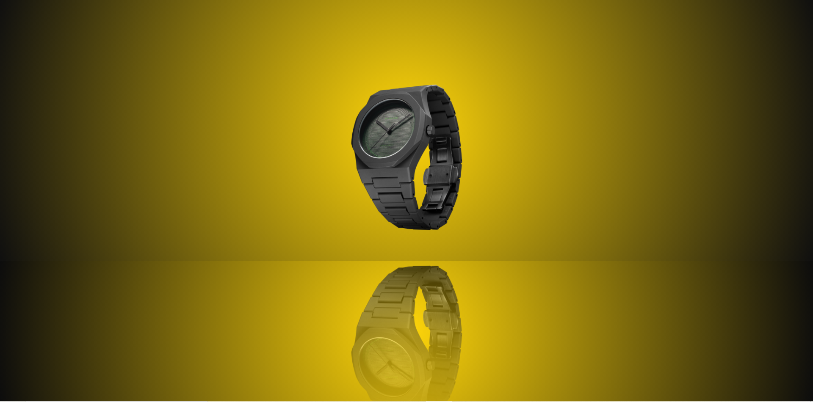

# WATCH 

This mini project is about mirror effect with watch with the use of css. 

# How to run app 

 * You can write this code on any text editor.
 * give the extension `.html`
 * open in browser
 * For css give the `.css`extension 
 * give that css file path to this html 
 * `<link rel="stylesheet" href="path/file.css">`

## What it looks like

    
 

