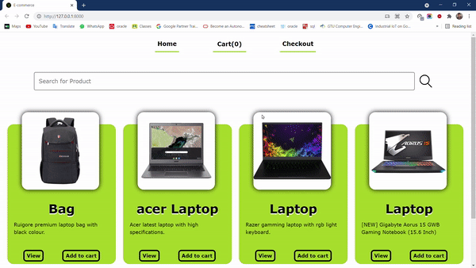

# E-COMMERCE

This project is full stack website named E-COMMERCE.
In this project user can see and pick items which they want to buy. They can also choose items which they want to purchase by giving their userfull informations.
For front-end html,css and javscript being used and for back-end django with sqlite database has used.

---

  

