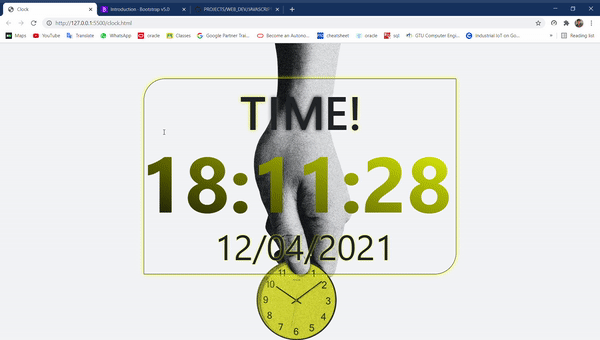

# CLOCK

Here i create an clock with the help of javascript ,  css and html. You can also visite this website from below url. 

## URL : [clock-tik-tok.epizy.com](http://clock-tik-tok.epizy.com/?i=1)

# How to run app 

 * You can write this code on any text editor.
 * give the extension `.html`
 * open in browser
 * For css give the `.css`extension 
 * give that css file path to this html 
 * `<link rel="stylesheet" href="path/file.css">`
 * give that javascript file path to this html of use script tag
 * for external file - ``

## What it looks like

  

