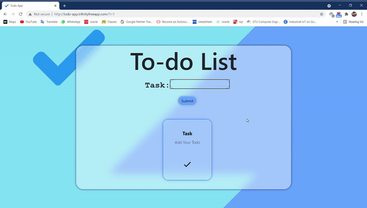

# TODO-APP

Here this is simple todo app with the react js this todo website add todo to the list and you also can delete or remove this todo after completing.

# How to run app

```
npx create-react-app my-app
cd my-app
npm start 
```

## What it looks like

<p align="center">
  
</P>
